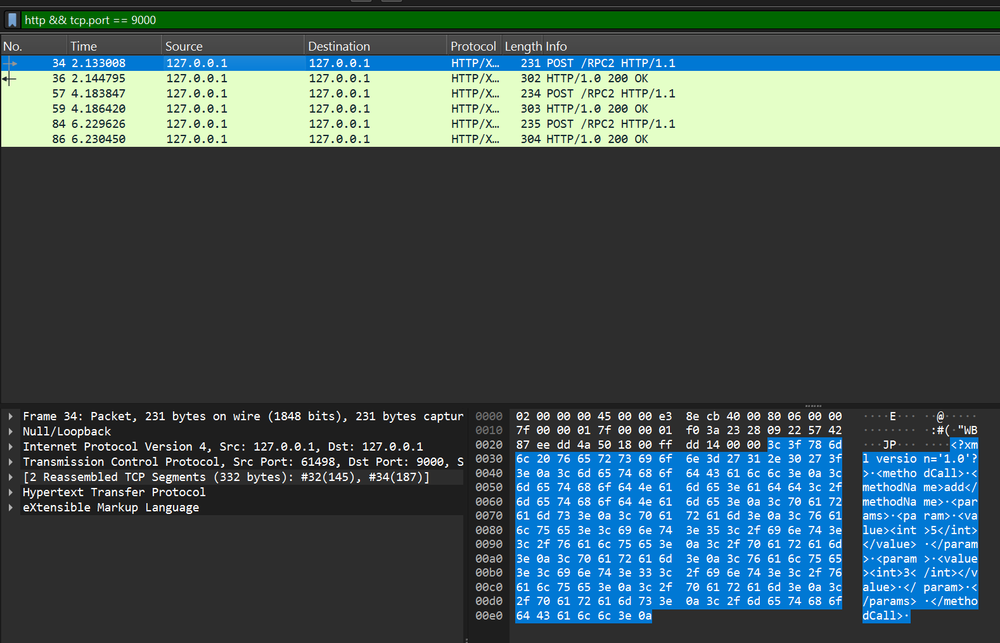
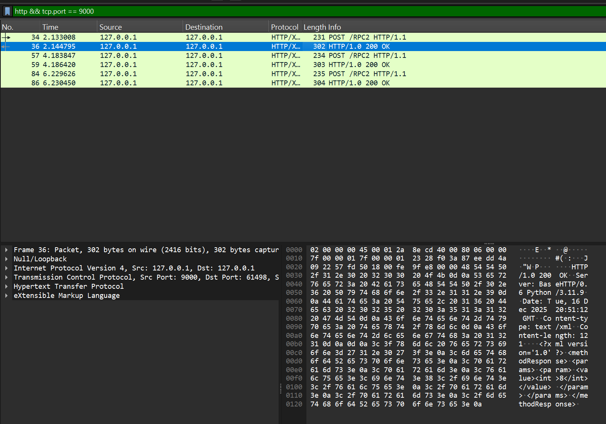
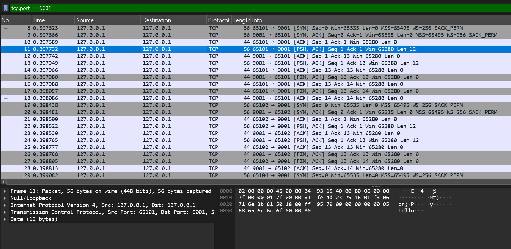
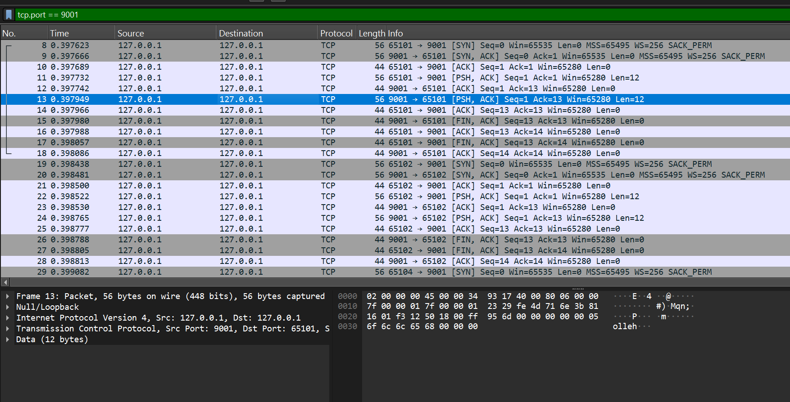
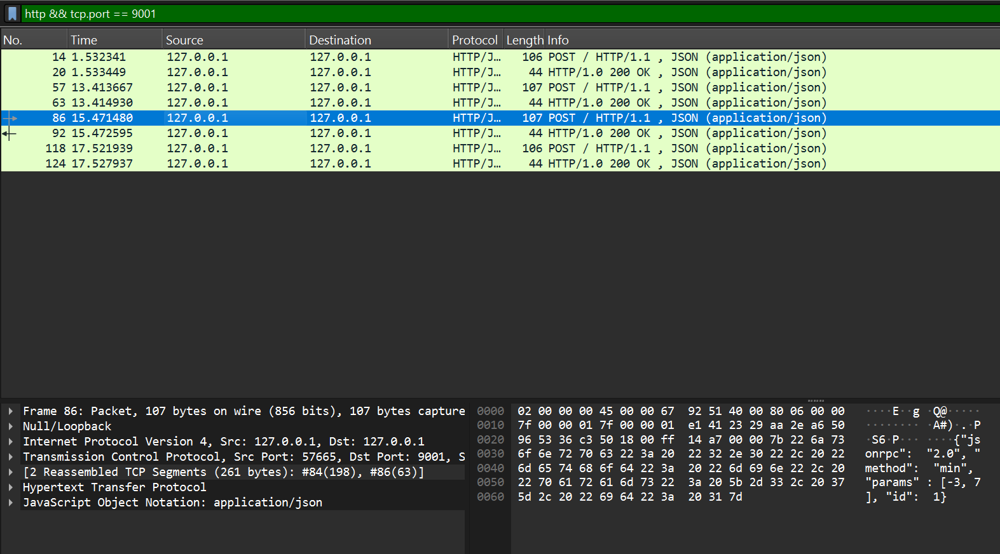
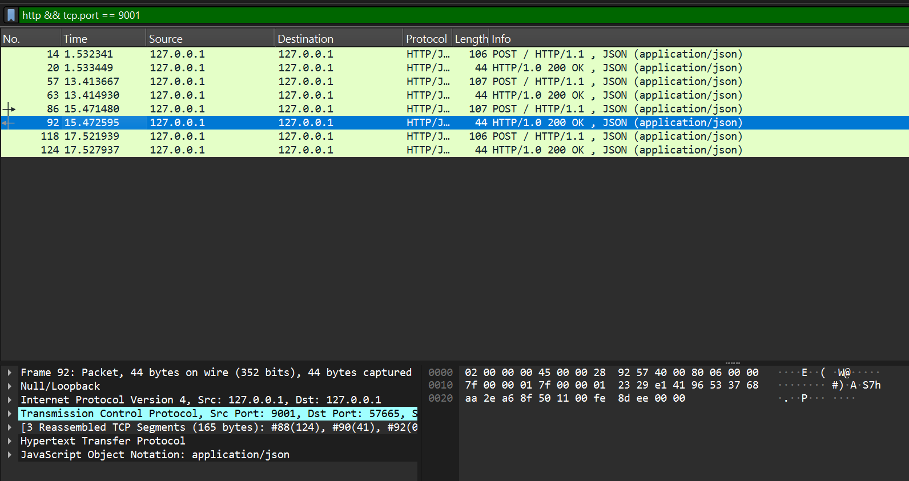
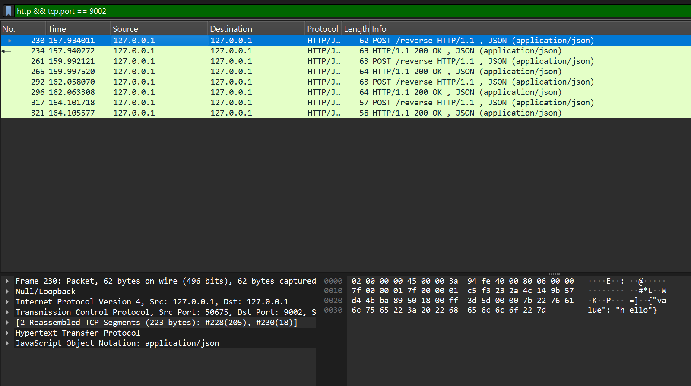
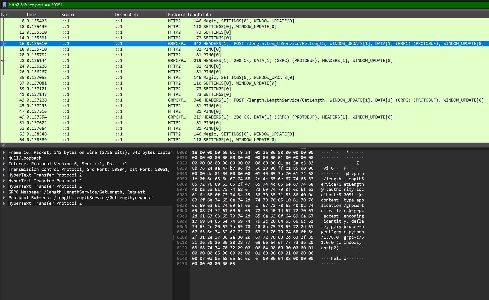
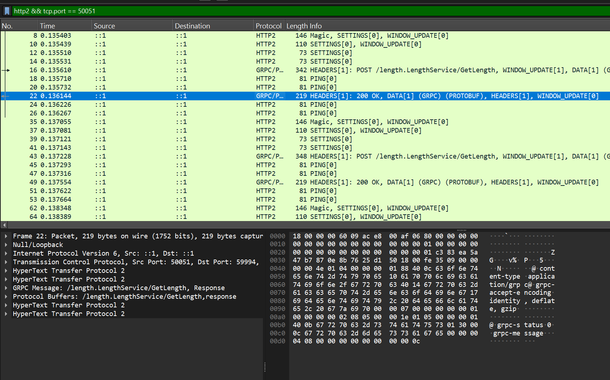

# Rapport de Projet : Développement d'Applications Réparties
## Analyse comparative RPC : XML-RPC, XDR-RPC, JSON-RPC, REST/JSON, gRPC

**Module :** Développement d'Applications Réparties  
**Étudiant :** Saif Eddine Riahi 
**enseignant :** Maher Jabberi
**Date :** 10 Décembre 2025  
**Institution :** ISSAT Mateur

---

## 1. Introduction

Ce projet explore cinq protocoles **Remote Procedure Call (RPC)** : XML-RPC, XDR-RPC, JSON-RPC, REST/JSON et gRPC. Pour chaque protocole, nous avons implémenté un serveur et client Python, capturé le trafic réseau avec Wireshark, puis analysé les différences de sérialisation, taille des trames et lisibilité.

**Objectifs :** Comparer format sur le fil, lisibilité, sécurité transport et cas d'usage pour chaque protocole RPC.

---

## 2. Environnement & Configuration

### Technologies
- **Python 3.9+**, Wireshark 4.0+
- **Bibliothèques :** xmlrpc (stdlib), struct, Flask, requests, grpcio, grpcio-tools

### Ports utilisés
| Protocole | Port | Fonction |
|-----------|------|----------|
| XML-RPC | 9000 | Addition de deux entiers |
| XDR-RPC | 9001 | Inversion d'une chaîne |
| JSON-RPC | 9001 | Minimum de deux valeurs |
| REST/JSON | 9002 | POST /reverse (inversion) |
| gRPC | 50051 | Longueur d'une chaîne |

---

## 3. Protocole XML-RPC

### Synthèse
XML-RPC sérialise en XML sur HTTP. Format textuel très lisible mais verbeux.

### Implémentation
```python
# Serveur
from xmlrpc.server import SimpleXMLRPCServer
def add(x, y): return x + y
server = SimpleXMLRPCServer(('localhost', 9000))
server.register_function(add, 'add')
server.serve_forever()

# Client
import xmlrpc.client
proxy = xmlrpc.client.ServerProxy('http://localhost:9000')
print(proxy.add(5, 3))  # Output: 8
```

### Analyse Wireshark

**Requête HTTP POST contenant XML :**



**Observations :** Frame ≈231 bytes. Payload XML `<methodCall><methodName>add</methodName>` totalement lisible.

**Réponse HTTP 200 OK avec XML :**



**Observations :** Frame ≈302 bytes. `<methodResponse><int>8</int>` visible en clair. Verbosité XML augmente la taille.

**Analyse :** Lisibilité ★★★★★, Taille importante, HTTP/HTTPS pour sécurité, idéal pour debugging.

---

## 4. Protocole XDR-RPC

### Synthèse
XDR encode en binaire (big-endian). Compact mais illisible sans décodeur.

### Implémentation
```python
# Serveur
import struct
from http.server import HTTPServer, BaseHTTPRequestHandler

class XDRHandler(BaseHTTPRequestHandler):
    def do_POST(self):
        body = self.rfile.read(int(self.headers['Content-Length']))
        str_len, = struct.unpack('!I', body[:4])
        input_str = body[4:4+str_len].decode('utf-8')
        result = input_str[::-1]  # Inverse
        response = struct.pack('!I', len(result)) + result.encode()
        self.send_response(200)
        self.end_headers()
        self.wfile.write(response)

server = HTTPServer(('localhost', 9001), XDRHandler)
server.serve_forever()
```

### Analyse Wireshark

**Requête TCP avec payload binaire XDR :**



**Observations :** Frame ≈56 bytes. Data (12 bytes) en binaire, visible seulement en hex dump.

**Réponse TCP avec XDR binaire :**



**Observations :** Frame ≈56 bytes. Chaîne "olleh" encodée en binaire compact.

**Analyse :** Lisibilité ★☆☆☆☆, Très compact (~75% plus petit qu'XML), difficile à analyser manuellement.

---

## 5. Protocole JSON-RPC

### Synthèse
JSON-RPC 2.0 : format structuré JSON avec `jsonrpc`, `method`, `params`, `id`.

### Implémentation
```python
# Serveur
from http.server import HTTPServer, BaseHTTPRequestHandler
import json

class JSONRPCHandler(BaseHTTPRequestHandler):
    def do_POST(self):
        body = json.loads(self.rfile.read(int(self.headers['Content-Length'])))
        if body.get('method') == 'min':
            result = min(body.get('params', []))
            response = {"jsonrpc": "2.0", "result": result, "id": body.get('id')}
        self.send_response(200)
        self.end_headers()
        self.wfile.write(json.dumps(response).encode())

server = HTTPServer(('localhost', 9001), JSONRPCHandler)
server.serve_forever()
```

### Analyse Wireshark

**Requête HTTP avec JSON-RPC 2.0 :**



**Observations :** Frame ≈107 bytes. JSON `{"jsonrpc":"2.0","method":"min","params":[-3,7]}` lisible.

**Réponse HTTP avec result JSON :**



**Observations :** Petite frame. JSON `{"result":-3,"id":1}` clair et structuré.

**Analyse :** Lisibilité ★★★★☆, Taille intermédiaire, bon compromis texte/compacité.

---

## 6. Protocole REST/JSON

### Synthèse
Architecture REST : ressources HTTP + verbes (POST, GET). État échangé en JSON.

### Implémentation
```python
# Serveur Flask
from flask import Flask, request, jsonify
app = Flask(__name__)

@app.route('/reverse', methods=['POST'])
def reverse():
    data = request.get_json()
    return jsonify({'result': data['value'][::-1]}), 200

app.run(host='localhost', port=9002)
```

### Analyse Wireshark

**Requête POST /reverse avec JSON :**



**Observations :** Frame ≈62 bytes. URI `/reverse` + JSON `{"value":"hello"}` explicite.

**Réponse HTTP 200 OK avec JSON :**


**Observations :** Frame ≈63 bytes. `{"result":"olleh"}` compact et clair.

**Analyse :** Lisibilité ★★★★★, Très compact, HTTP standard universel, idéal pour APIs web.

---

## 7. Protocole gRPC

### Synthèse
gRPC : Protocol Buffers (binaire) + HTTP/2. Haute performance, streaming natif.

### Implémentation
```protobuf
// length.proto
syntax = "proto3";
package length;

service LengthService {
  rpc GetLength(StringRequest) returns (StringReply) {}
}
message StringRequest { string value = 1; }
message StringReply { int32 length = 1; }
```

```python
# Serveur
import grpc, length_pb2, length_pb2_grpc
from concurrent import futures

class LengthServicer(length_pb2_grpc.LengthServiceServicer):
    def GetLength(self, request, context):
        return length_pb2.StringReply(length=len(request.value))

server = grpc.server(futures.ThreadPoolExecutor(max_workers=10))
length_pb2_grpc.add_LengthServiceServicer_to_server(LengthServicer(), server)
server.add_insecure_port('[::]:50051')
server.start()
server.wait_for_termination()
```

### Analyse Wireshark

**Requête HTTP/2 avec Protocol Buffers :**



**Observations :** Frame ≈342 bytes. HTTP/2 POST `/length.LengthService/GetLength`, DATA protobuf binaire illisible.

**Réponse HTTP/2 avec protobuf :**



**Observations :** Frame ≈219 bytes. Réponse binaire compacte, nécessite .proto pour interpréter.

**Analyse :** Lisibilité ★☆☆☆☆, Très compact, HTTP/2 performant, idéal pour microservices.

---

## 8. Analyse Comparative

### Tableau de synthèse

| **Critère** | **XML-RPC** | **XDR-RPC** | **JSON-RPC** | **REST/JSON** | **gRPC** |
|---|---|---|---|---|---|
| **Lisibilité** | ★★★★★ | ★☆☆☆☆ | ★★★★☆ | ★★★★★ | ★☆☆☆☆ |
| **Taille (bytes)** | 230-300 | 50-100 | 100-150 | 60-100 | 100-350 |
| **Format** | HTTP+XML | TCP+XDR binaire | HTTP+JSON | HTTP+JSON | HTTP/2+Protobuf |
| **Transport sécurisé** | HTTPS | HTTPS | HTTPS | HTTPS | TLS/mTLS |
| **Multi-langage** | Excellent | Bon | Excellent | Universel | Excellent |
| **Streaming** | Non | Non | Non | Non | Oui (natif) |
| **Cas d'usage** | Legacy web | Contraintes bande passante | APIs simples | APIs web modernes | Microservices haute perf |

### Recommandations par cas d'usage

- **API web publique** → REST/JSON : standard, caching HTTP, universellement supporté
- **Microservices internes** → gRPC : performance, streaming, type-safe
- **Prototype rapide** → REST/JSON ou JSON-RPC : setup minimal, testable immédiatement
- **Système legacy** → XML-RPC ou XDR-RPC : compatibilité existante
- **IoT/embedded** → JSON-RPC : léger, simple, support universel

---

## 9. Méthodologie Wireshark

### Procédure de capture
1. Ouvrir Wireshark, interface Loopback
2. Filtre par port : `tcp.port == 9000` (XML-RPC), `tcp.port == 9001` (XDR/JSON-RPC), `tcp.port == 9002` (REST), `tcp.port == 50051` (gRPC)
3. Lancer serveur, puis client
4. Enregistrer capture : `File > Export Specified Packets` → `.pcapng`
5. Stocker dans `wireshark-captures/`

### Tests réalisés
| Protocole | Fonction | Input | Output attendu | Status |
|---|---|---|---|---|
| XML-RPC | add | (5, 3) | 8 | ✓ PASS |
| XDR-RPC | reverse | "hello" | "olleh" | ✓ PASS |
| JSON-RPC | min | [-3, 7] | -3 | ✓ PASS |
| REST/JSON | /reverse | {"value":"hello"} | {"result":"olleh"} | ✓ PASS |
| gRPC | GetLength | "hello" | 5 | ✓ PASS |

### Structure du dépôt Git
```
Projet-RPC/
├── xml-rpc/
│   ├── server.py
│   └── client.py
├── xdr-rpc/
│   ├── server.py
│   └── client.py
├── json-rpc/
│   ├── server.py
│   └── client.py
├── rest-json/
│   ├── server.py
│   └── client.py
├── grpc/
│   ├── length.proto
│   ├── server.py
│   └── client.py
├── wireshark-captures/
│   ├── xml-rpc-request.png
│   ├── xml-rpc-response.png
│   ├── xdr-rpc-request.png
│   ├── xdr-rpc-response.png
│   ├── json-rpc-request.png
│   ├── json-rpc-response.png
│   ├── rest-json-request.png
│   ├── rest-json-response.png
│   ├── grpc-request.png
│   └── grpc-response.png
└── rapport_final.md
```

---

## 10. Conclusion

Ce projet a démontré les différences fondamentales entre cinq approches RPC. **XML-RPC** et **XDR-RPC** sont historiques mais dépassés. **JSON-RPC** offre un bon compromis. **REST/JSON** domine les APIs web modernes grâce à sa simplicité et son universalité. **gRPC** s'impose pour les microservices nécessitant haute performance et streaming.

Les captures Wireshark ont validé les caractéristiques théoriques : XML/JSON sont lisibles mais plus volumineux, XDR/Protobuf sont compacts mais opaques, HTTP/2 optimise le transport.

### Perspectives
- Implémenter sécurité (TLS/mTLS, OAuth2)
- Benchmark performance (latence, throughput)
- Containerisation Docker + orchestration
- Monitoring avec Prometheus/Jaeger

---

**Auteur :** Saif Eddine Riahi 
**Dépôt Git :** [GitHub Saif Riahi](https://github.com/Red-Wolf01/Projet-RPC-M.git) 
**Date :** 10 Décembre 2025